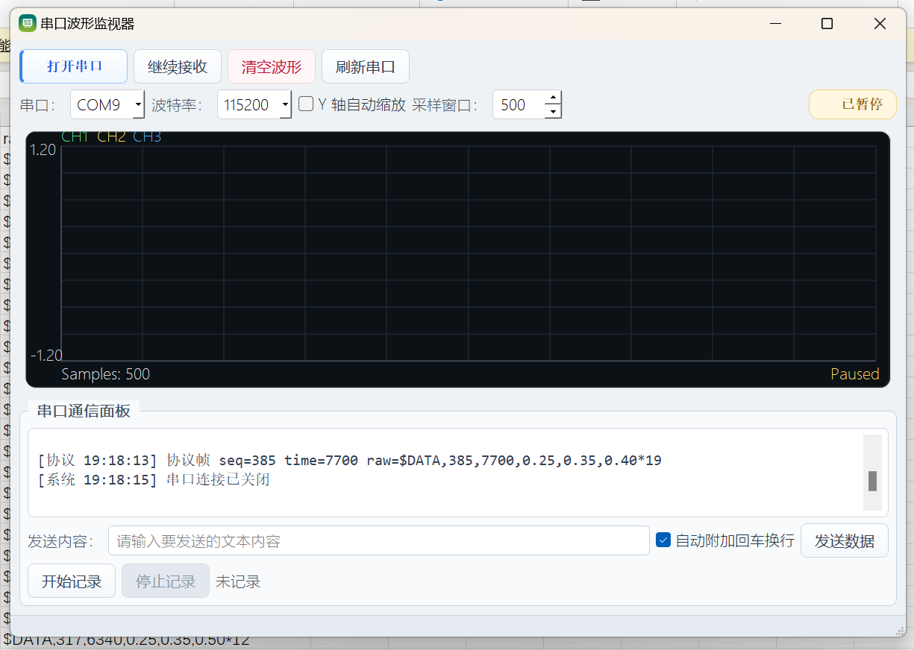
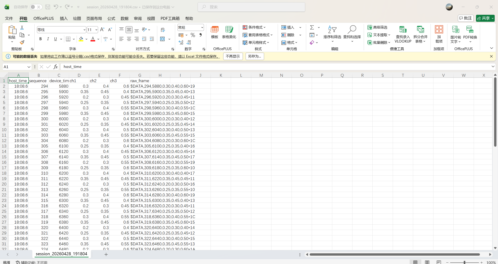

# Qt Serial Waveform Monitor

一个基于 Qt Widgets 和 Qt Serial Port 的串口波形监视器示例项目，面向“可读、可学、可复用”的开源场景设计。

它可以接收串口 ASCII 数据或自定义 `$DATA` 协议帧，完成实时波形绘制、协议日志显示和 CSV 记录，适合作为以下场景的参考项目：

- Qt 上位机练手项目
- STM32 / MCU 串口采集链路示例
- 串口协议解析与可视化示例
- 求职作品集中的完整小型工程样本

## 项目特点

- 基于 `Qt Serial Port` 封装串口扫描、打开、关闭、发送和异常处理
- 同时支持普通 ASCII 数值行和 `$DATA` 协议帧输入
- 自带协议解析、XOR 校验、半包缓存、粘包拆分和基础丢包统计
- 使用自绘 `PlotWidget` 实现多通道实时波形显示
- 支持暂停接收、清空波形、采样窗口调整和 Y 轴自动缩放
- 支持串口收发日志和协议解析日志
- 支持 CSV 记录，保留时间戳、序号、通道值、扩展通道和原始帧
- 包含核心测试、UI 测试、qmake 工程和 CMake 构建入口

## 截图

### 实时波形与协议日志



### CSV 记录结果



## 支持的数据格式

### 1. 普通 ASCII 数值

单通道：

```text
0.1
0.2
0.3
```

多通道：

```text
0.1,0.2,0.3
0.2,0.3,0.4
0.3,0.4,0.5
```

### 2. 协议帧格式

```text
$DATA,<seq>,<timestamp_ms>,<ch1>,<ch2>,<ch3>*<crc>\r\n
```

示例：

```text
$DATA,15,123456,25.60,60.20,3.31*7A
```

详细说明见 [docs/protocol.md](docs/protocol.md)。

## 项目结构

```text
src/
  core/         数据容器、环形缓冲区和多通道数据流
  plot/         波形绘制控件
  protocol/     协议帧与协议解析器
  readers/      串口文本读取与协议接入
  serial/       串口控制和错误处理
  storage/      CSV 记录
docs/
  hardware.md   STM32 / USB-TTL 联调说明
  protocol.md   串口协议说明
  release.md    Windows 打包与发布说明
  images/       README 截图资源
firmware/
  stm32_uart_demo/  STM32 UART 示例
tests/
  core/         核心测试
  ui/           UI 测试
.github/
  workflows/    GitHub Actions 配置
```

## 代码结构速览

这个项目可以按下面这条数据链路来理解：

```text
串口设备 / 模拟数据
  -> SerialController
  -> AsciiReader / ProtocolParser
  -> SamplePack / Stream / RingBuffer
  -> PlotWidget
  -> MainWindow / CsvRecorder
```

各模块职责大致如下：

- `SerialController`：负责串口枚举、打开、关闭、发送和错误处理
- `AsciiReader`：面向 `QIODevice` 读取文本流，并桥接普通 ASCII 与协议帧
- `ProtocolParser`：负责协议字段解析、校验和错误统计
- `Stream` / `RingBuffer`：负责波形数据缓存和多通道管理
- `PlotWidget`：负责实时波形绘制
- `CsvRecorder`：负责将数据持久化为 CSV
- `MainWindow`：负责界面状态、用户操作和整体流程协调

## 已验证场景

项目已经完成一轮基于真实硬件的串口联调，链路如下：

```text
STM32 USART1 (PA9 / PA10)
  -> CH340 USB-TTL
  -> Windows 串口
  -> Qt 上位机接收
  -> 协议解析
  -> 实时波形显示
  -> CSV 记录
```

联调说明见 [docs/hardware.md](docs/hardware.md)。

## 构建环境

- Qt 5.14.2 或兼容的 Qt 5 版本
- Qt 模块：`Core`、`Gui`、`Widgets`、`SerialPort`、`Test`
- Windows
- MinGW 64-bit 或兼容工具链

## 使用 Qt Creator 构建

1. 打开 Qt Creator
2. 选择 `Open Project`
3. 打开 `serialport.pro`
4. 选择包含 `Qt Serial Port` 的 Desktop Kit
5. 构建并运行

## 使用 qmake 构建

```powershell
cd D:\QTProject\serialport\serialport\serialport
$env:Path = "D:\Qt\Qt5.14.2\Tools\mingw730_64\bin;D:\Qt\Qt5.14.2\5.14.2\mingw73_64\bin;" + $env:Path
D:\Qt\Qt5.14.2\5.14.2\mingw73_64\bin\qmake.exe serialport.pro
mingw32-make
```

## 使用 CMake 构建

```powershell
cd D:\QTProject\serialport\serialport\serialport
$env:Path = "D:\Qt\Qt5.14.2\Tools\mingw730_64\bin;D:\Qt\Qt5.14.2\5.14.2\mingw73_64\bin;" + $env:Path
$env:CMAKE_PREFIX_PATH = "D:\Qt\Qt5.14.2\5.14.2\mingw73_64"
cmake -S . -B build -G "MinGW Makefiles" -DBUILD_TESTING=ON
cmake --build build
ctest --test-dir build --output-on-failure
```

## 测试

当前仓库包含两类测试：

- `tests/core`：核心逻辑测试，包括协议解析和 CSV 记录
- `tests/ui`：界面与波形行为测试

项目也提供了 GitHub Actions 构建配置，见 [.github/workflows/build.yml](.github/workflows/build.yml)。

## 开源协作

欢迎提交 issue、功能建议和 pull request。协作约定见 [CONTRIBUTING.md](CONTRIBUTING.md)。

如果你准备把它扩展成自己的上位机项目，建议优先从下面几个方向开始：

- 丰富协议类型和设备命令
- 增加通道显隐、命名和颜色配置
- 支持历史数据回放
- 支持更稳定的发布和安装流程

## 相关文档

- [docs/protocol.md](docs/protocol.md)：协议说明
- [docs/hardware.md](docs/hardware.md)：硬件联调说明
- [docs/release.md](docs/release.md)：Windows 打包与发布说明

## License

本项目使用 [MIT License](LICENSE)。
